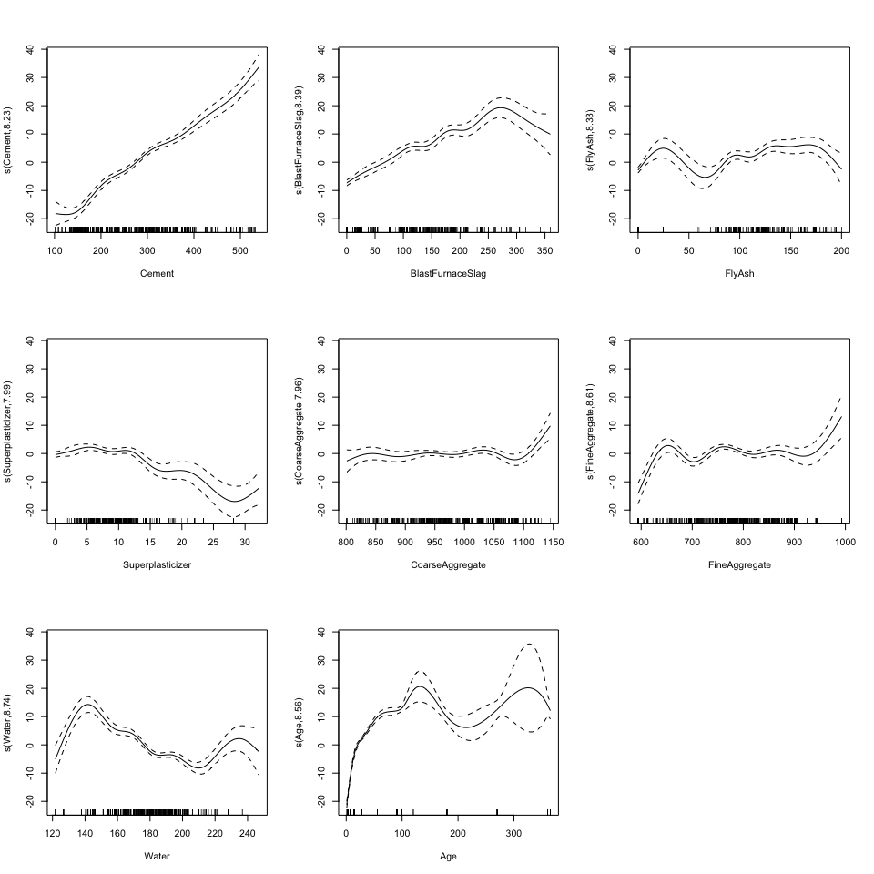

HW2
================
JunLu
3/17/2019

Overview
--------

In this exercise, we build nonlinear models using the concrete compressive strength data set. Concrete is the most important material in civil engineering. The concrete compressive strength is a nonlinear function of age and ingredients. These ingredients include cement, blast furnace slag, fly ash, water, superplasticizer, coarse aggregate, and fine aggregate. The data are in “concrete.csv”. Concrete compressive strength is the response.

Import the data
---------------

``` r
concrete = read_csv("./concrete.csv")
# matrix of predictors
x <- model.matrix(CompressiveStrength~.,concrete)[,-1] 
# vector of response
y <- concrete$CompressiveStrength
```

Set the random seed
-------------------

``` r
set.seed(223)
```

a) Scatter Plots
----------------

Create scatter plots of response vs. predictors using the function featurePlot().

``` r
featurePlot(x, y, plot = "scatter", labels = c("","Y"), type = c("p"), layout = c(4, 2))
```

 From scatter plots of response vs. predictors, we can't see a clear linear relationship between the response and the other predictors (maybe there is one between the response and the cement).

b) Polynomial Regression
------------------------

Perform polynomial regression to predict compressive strength using water as the predictor. For 1 &lt;= d &lt;= 4, use cross-validation to select the optimal degree d for the polynomial. What degree was chosen, and how does this compare to the results of hypothesis testing using ANOVA? Make a plot of different polynomial fits to the data.

### Fit polynomial regression models

``` r
fit1 = lm(CompressiveStrength ~ Water, data = concrete)
fit2 = lm(CompressiveStrength~poly(Water,2), data = concrete)
fit3 = lm(CompressiveStrength~poly(Water,3), data = concrete)
fit4 = lm(CompressiveStrength~poly(Water,4), data = concrete)
```

### Calculate the 10-fold CV MSE

``` r
ctrl1 <- trainControl(method = "cv", number = 10)

lmfit = function(x){
    f = bquote(CompressiveStrength~poly(Water, .(x)))
    train(
        as.formula(f),
        data = concrete,
        method = "lm",
        trControl = ctrl1
    )
}

lm = list()

for (i in 1:4) {
    lm[[i]] = lmfit(i)
}

resamp <- resamples(lm) 
summary(resamp)
```

    ## 
    ## Call:
    ## summary.resamples(object = resamp)
    ## 
    ## Models: Model1, Model2, Model3, Model4 
    ## Number of resamples: 10 
    ## 
    ## MAE 
    ##            Min.  1st Qu.   Median     Mean  3rd Qu.     Max. NA's
    ## Model1 11.87460 12.49893 12.98883 13.09113 13.66461 14.56374    0
    ## Model2 11.44327 11.84038 12.38525 12.48449 13.02398 14.24876    0
    ## Model3 11.47165 12.00635 12.18001 12.24232 12.44810 13.04330    0
    ## Model4 10.66400 11.98991 12.07567 12.08111 12.49885 13.44716    0
    ## 
    ## RMSE 
    ##            Min.  1st Qu.   Median     Mean  3rd Qu.     Max. NA's
    ## Model1 14.80163 15.08720 15.78449 15.96762 16.78673 17.69748    0
    ## Model2 13.90633 14.50902 15.40873 15.51744 16.70747 17.14093    0
    ## Model3 14.09920 14.87135 15.09881 15.16365 15.26622 16.49061    0
    ## Model4 13.30591 14.67609 15.12749 15.00026 15.37352 16.51858    0
    ## 
    ## Rsquared 
    ##              Min.    1st Qu.     Median       Mean   3rd Qu.      Max.
    ## Model1 0.02250082 0.06180123 0.09036476 0.09205593 0.1165072 0.1822679
    ## Model2 0.04682170 0.09472728 0.12564692 0.15741873 0.2155084 0.3042959
    ## Model3 0.06895659 0.13958574 0.19725009 0.18799364 0.2152095 0.3279972
    ## Model4 0.07472655 0.16063323 0.20459595 0.19902195 0.2272022 0.3341658
    ##        NA's
    ## Model1    0
    ## Model2    0
    ## Model3    0
    ## Model4    0

According to the 10-fold CV MSE, the model with the degree of 4 has the lowest CV MSE. Thus, thr optimal degree is 4.

### ANOVA Test

``` r
anova(fit1,fit2,fit3,fit4)
```

    ## Analysis of Variance Table
    ## 
    ## Model 1: CompressiveStrength ~ Water
    ## Model 2: CompressiveStrength ~ poly(Water, 2)
    ## Model 3: CompressiveStrength ~ poly(Water, 3)
    ## Model 4: CompressiveStrength ~ poly(Water, 4)
    ##   Res.Df    RSS Df Sum of Sq      F    Pr(>F)    
    ## 1   1028 263085                                  
    ## 2   1027 247712  1   15372.8 68.140 4.652e-16 ***
    ## 3   1026 235538  1   12174.0 53.962 4.166e-13 ***
    ## 4   1025 231246  1    4291.5 19.022 1.423e-05 ***
    ## ---
    ## Signif. codes:  0 '***' 0.001 '**' 0.01 '*' 0.05 '.' 0.1 ' ' 1

According to ANOVA test, we choose the model with the degree of 4.

### Plots

``` r
fit = list(fit1, fit2, fit3, fit4)

p_0 = ggplot(data = concrete, 
            aes(x = Water, y = CompressiveStrength)) + 
    geom_point(color = rgb(.2, .4, .2, .5))


water_range = range(concrete$Water)
water_grid = data.frame(Water = seq(from = water_range[1], to = water_range[2]))

poly_plot = function(degree){
    title = paste("Degree of freedom: ", degree)
    pred = predict(fit[[degree]], newdata = water_grid)
    df = data.frame(pred = pred,
                    water = water_grid$Water)
    p =  p_0 +
    geom_line(aes(x = water, y = pred),
              data = df,
              color = rgb(.8, .1, .1, 1)
              ) +
    labs(
        title = title
    )
}

p1 = poly_plot(1)
p2 = poly_plot(2)
p3 = poly_plot(3)
p4 = poly_plot(4)
p1 + p2 + p3 + p4
```


c)
--

Fit a smoothing spline using water as the predictor for a range of degrees of freedom, as well as the degree of freedom obtained by generalized cross-validation, and plot the resulting fits. Describe the results obtained.

### The degree of freedom obtained by generalized cv

``` r
gen_smooth = smooth.spline(concrete$Water,concrete$CompressiveStrength)

pred_gen = predict(gen_smooth, x = water_grid$Water)

gen_smooth$df
```

    ## [1] 68.88205

``` r
df_spine_pre = data.frame(water = water_grid$Water,
                          pred = pred_gen$y)
p_gen_smooth = p_0 +
    geom_line(aes(x = water, y = pred),
              data = df_spine_pre,
              color = rgb(.8, .1, .1, 1)
              ) +
    labs(
        title = "Degree of freedom: 68.88205 (obtained by generalized cv)"
    )
p_gen_smooth
```


The degree of freedom obtained by generalized cv is 68.88205.

### A range of degrees of freedom

``` r
spline = function(degree){
    title = paste("Degree of freedom: ", degree)
    spline = smooth.spline(concrete$Water,concrete$CompressiveStrength, df = degree)
    pred = predict(spline, x = water_grid$Water)
    df_spine_pre = data.frame(water = water_grid$Water,
                          pred = pred$y)
    
    p = p_0 +
    geom_line(aes(x = water, y = pred),
              data = df_spine_pre,
              color = rgb(.8, .1, .1, 1)
              ) +
    labs(
        title = title
    )
}

p = list()
for (i in 1:15) {
    p[[i]] = spline(5*i)
}

p[[1]] + p[[2]] + p[[3]] + p[[4]] + p[[5]] + p[[6]] + p[[7]] + p[[8]] + 
    p[[9]] + p[[10]] + p[[11]] + p[[12]] + p[[13]] + p[[14]] + p[[15]] + 
    plot_layout(ncol = 3, nrow = 5)
```


Describe the results obtained:

The concrete compressive strength is a nonlinear function of water. When we only use water as a predictor and use the degree of freedom obtained by generalized cv to fit the data, the fitted curve can be very shifty.

From the plots we can see that when degree of freedom goes up, the smoothing spline fits the data better. However, when df is too large, it tends to be overfitted.

d)
--

Fit a GAM using all the predictors. Plot the results and explain your findings.

``` r
gam.fit = train(x, y,
                 method = "gam",
                 tuneGrid = data.frame(method = "GCV.Cp", 
                                       select = c(TRUE,FALSE)), 
                 trControl = ctrl1)
gam.fit$bestTune
```

    ##   select method
    ## 1  FALSE GCV.Cp

``` r
gam.fit$finalModel
```

    ## 
    ## Family: gaussian 
    ## Link function: identity 
    ## 
    ## Formula:
    ## .outcome ~ s(Age) + s(Superplasticizer) + s(FlyAsh) + s(BlastFurnaceSlag) + 
    ##     s(Water) + s(Cement) + s(CoarseAggregate) + s(FineAggregate)
    ## 
    ## Estimated degrees of freedom:
    ## 8.56 7.99 8.33 8.39 8.74 8.23 7.96 
    ## 8.61  total = 67.81 
    ## 
    ## GCV score: 30.78582

``` r
gam = gam(CompressiveStrength ~ s(Cement) + s(BlastFurnaceSlag) + s(FlyAsh) +
                  s(Superplasticizer) + s(CoarseAggregate) + s(FineAggregate) + 
                  s(Water) + s(Age), data = concrete)
```

According to the MSE of CV, we fit every predictor with smoothing spline.

``` r
par(mfrow = c(3,3))
plot(gam)
```



The concrete compressive strength is a nonlinear function of age and ingredients (blast furnace slag, fly ash, water, superplasticizer, coarse aggregate, and fine aggregate), however the concrete compressive strength is likely to be a linear function of cement holding other variable fixed.

-   Water: When adding other factors into the model, the curve of the concrete compressive strength vs. water become smooth. Approximately at the range of 120 - 140 of water, the strength increases with more water. At the range of 140 - 200, the strength decreases with more water.
